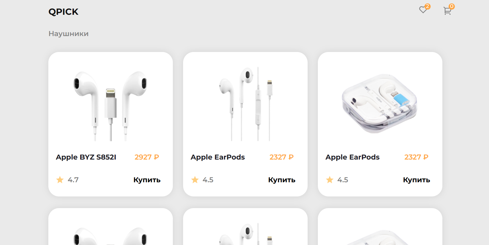
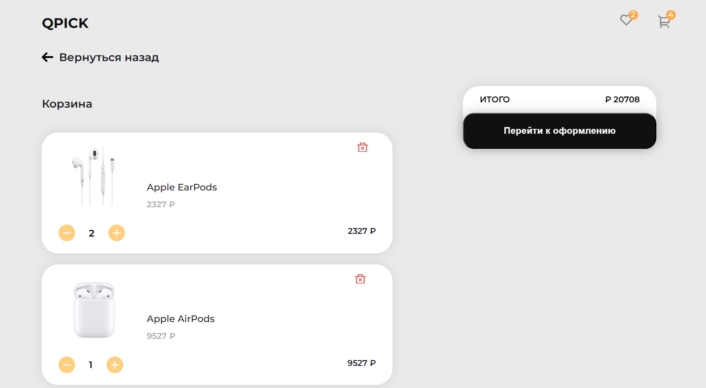

## Online store catalog page and shopping cart

## Implemented:
- catalog and shopping cart layout
- adding items to cart
- changing the quantity of goods in the cart
- removing an item from the cart
- calculating the total cost of items in the cart

## Available Scripts

In the project directory, you can run:

### `npm start`

Runs the app in the development mode.\
Open [http://localhost:3000](http://localhost:3000) to view it in the browser.
